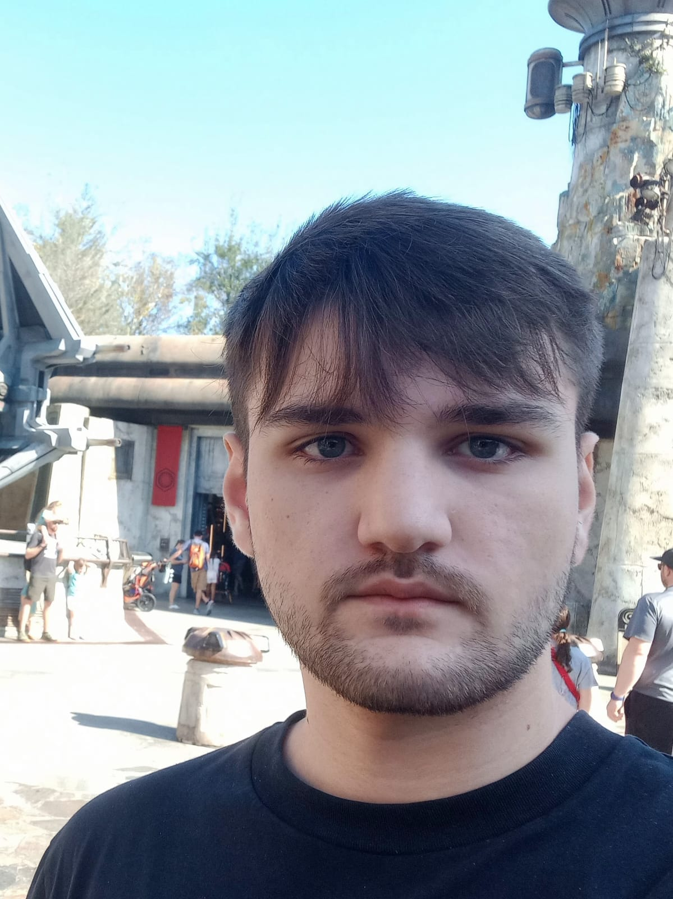

  
  
  <h1>🌴 Portfolio-2.0</h1>
  

  

---

## ✨ Sobre o Projeto

Este é o meu portfólio pessoal, desenvolvido com Next.js, TailwindCSS e animações GSAP. Aqui você encontra meus principais projetos, habilidades, experiências e formas de contato.

- Interface moderna e responsiva
- Animações suaves com GSAP

## 🚀 Tecnologias Utilizadas

- ⚡ **Next.js**
- 🎨 **TailwindCSS**
- 💙 **TypeScript**
- 🌀 **GSAP** (animações)
- 🖼️ **Next/Image**
- 🦾 **Lucide Icons**

---

## 📬 Contato

- ✉️ Email: contato.fabriciomagoga@gmail.com
- 💼 [LinkedIn](https://www.linkedin.com/in/fabriciomagoga/)
- 🐙 [GitHub](https://github.com/magoga-br)

---

  

